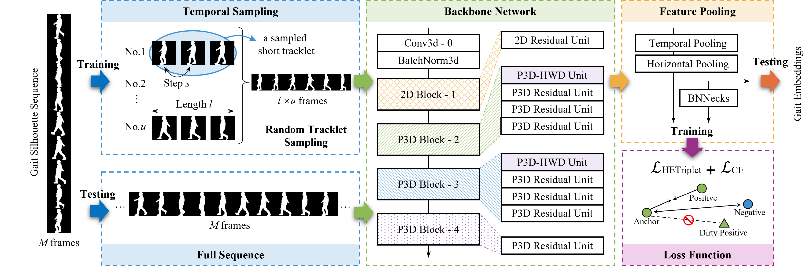

# TrackletGait: A Robust Framework for Gait Recognition in the Wild



**Paper** [[arXiv](https://arxiv.org/pdf/2508.02143)] [[IEEE](https://ieeexplore.ieee.org/abstract/document/11154018)]

This project is based on [OpenGait](https://github.com/ShiqiYu/OpenGait), with additional dependencies from [torch-dwt](https://github.com/KeKsBoTer/torch-dwt).

Currently, only the modified parts of the code are provided. ~The full project will be released later after further organization.~

## Usage
Replace the files in the original OpenGait project with the ones provided here (overwrite files with the same name).

| File | Description |
|------|--------------|
| **`TrackletGait.py`** | Standard version of the TrackletGait model. Uses block configuration **[1, 4, 4, 1]**. Designed for **large-scale datasets** such as *Gait3D*, *GREW*, and *OU-MVLP*. |
| **`TrackletGait_s.py`** | Small version of the model with block configuration **[0, 1, 1, 0]**. Suitable for **small-scale datasets** such as *CASIA-B*, *CCPG*, and *SUSTech1K*. |
| **`trackletgait_gait3d.yaml`** | Example configuration file. The `sampler` field under `trainer_cfg` must be used together with **`collate_fn.py`**. |
| **`collate_fn.py`** | Implements **Random Tracklet Sampling** for sequence sampling within each batch during training, as described in the paper. |
| **`triplet_HardEx.py`** | Defines the **Hardness Exclusion Triplet Loss**, corresponding to the loss function introduced in the paper. |


## Result and Checkpoint

**Dataset: Gait3D**
[checkpoint](https://drive.google.com/file/d/18KKxCVshTKX6ewwOn2rwf815uM32kIET/view?usp=sharing)

```
{'scalar/test_accuracy/Rank-1': 77.7999997138977, 'scalar/test_accuracy/Rank-5': 88.99999856948853, 'scalar/test_accuracy/Rank-10': 92.10000038146973, 'scalar/test_accuracy/mAP': 70.20399214273307, 'scalar/test_accuracy/mINP': 51.6445367958063}
```
---

**Dataset: GREW**
[checkpoint](https://drive.google.com/file/d/10TQ8HSD9EJNDecV-0zHVq0rdlxBCt8Y4/view?usp=sharing)

```
Rank-1	Rank-5	Rank-10	Rank-20
0.8042	0.8975	0.9231	0.9406
```
[codalab link](https://codalab.lisn.upsaclay.fr/my/competition/submission/868017/detailed_results/)

| Submission Id | User | Phase | Date | Description | Rank-1 | Rank-5 | Rank-10 | Rank-20 | Rank-1 Distractor |
|----------------|------|--------|------|--------------|---------|---------|----------|----------|--------------------|
| 868017 | sxzhang | GREW Phase 3 | Dec 10 2024 | TrackletGait | 0.8042 | 0.8975 | 0.9231 | 0.9406 | 0.0000 |
---

**Dataset: OU-MVLP**
[checkpoint](https://drive.google.com/file/d/11Ld_5SuE_RIBYIM-Zo_Ik-_xVZhV99kA/view?usp=sharing)
```
===Rank-1 (Exclude identical-view cases)===
NM@R1: [90.53 92.57 92.30 92.55 92.75 92.15 92.00 91.93 91.80 91.75 91.91 91.93 91.43 91.34]
NM@R1: 91.92%
```
---

**Dataset: CASIA-B**
[checkpoint](https://drive.google.com/file/d/1wMoltPohD52_Zeogmjx84VaJE5FTafSP/view?usp=sharing)

(Model: small version)
```
===Rank-1 (Exclude identical-view cases)===
NM@R1: [98.20 100.00 100.00 99.90 98.10 98.00 98.40 99.50 100.00 99.50 96.00]
BG@R1: [95.10 98.00 98.10 97.37 94.50 91.80 94.50 97.70 98.20 97.47 93.80]
CL@R1: [80.50 93.10 93.80 92.20 86.80 83.60 85.30 89.30 90.10 88.50 77.80]
NM@R1: 98.87%     BG@R1: 96.05%   CL@R1: 87.36%
```
---

**Dataset: CCPG**
[checkpoint](https://drive.google.com/file/d/1LTeBi_x18bo4LUEyT3lgRPhQdk3iO5RV/view?usp=sharing)

(Model: small version. Data: only silhouette)
```
===Rank-1 (Exclude identical-view cases for Person Re-Identification)===
CL: 92.486,       UP: 96.707,     DN: 96.000,     BG: 97.611
===mAP (Exclude identical-view cases for Person Re-Identification)===
CL: 66.840,       UP: 85.867,     DN: 84.064,     BG: 89.956
===mINP (Exclude identical-view cases for Person Re-Identification)===
CL: 21.678,       UP: 61.313,     DN: 60.162,     BG: 68.736
===Rank-1 (Include identical-view cases)===
CL: 84.589,       UP: 89.717,     DN: 88.463,     BG: 93.396
===Rank-1 (Exclude identical-view cases)===
CL: 83.191,       UP: 88.738,     DN: 87.389,     BG: 92.912
===Rank-1 of each angle (Exclude identical-view cases)===
CL: [75.57 77.56 84.11 86.50 84.00 83.94 81.38 86.00 85.20 87.65]
UP: [85.15 84.67 88.22 90.22 90.89 91.22 85.99 90.78 86.68 93.56]
DN: [79.89 86.38 85.70 89.99 87.78 89.00 86.28 89.22 88.43 91.22]
BG: [88.69 89.54 95.11 96.78 94.33 95.67 92.04 91.44 90.92 94.61]
```
---


**Dataset: SUSTech1K**
[checkpoint](https://drive.google.com/file/d/1_GxxllwDrdRODw6WVZ7YC0zAMINhJmXq/view?usp=sharing)

(Model: small version. Data: only silhouette)
```
===Rank-1 (Exclude identical-view cases)===
Normal@R1: [83.97 86.61 93.27 89.75 89.59 94.38 86.78 90.74 94.44 89.59 88.60 93.55]
Bag@R1: [84.47 84.53 92.15 86.31 85.66 91.50 86.48 89.02 90.32 86.54 82.88 92.33]
Clothing@R1: [51.77 56.06 69.44 66.41 68.94 67.43 52.78 59.85 69.44 70.46 64.90 72.22]
Carrying@R1: [84.29 84.23 90.03 82.68 83.24 90.39 84.09 86.15 88.00 81.84 77.30 89.53]
Umberalla@R1: [86.13 87.06 95.69 87.82 85.95 94.35 85.32 89.45 94.81 90.74 85.90 97.09]
Uniform@R1: [81.42 83.70 93.11 87.16 84.49 93.68 84.29 89.53 92.51 86.76 83.10 93.18]
Occlusion@R1: [85.16 85.16 99.07 91.47 92.95 99.26 85.90 91.28 99.26 90.54 91.84 97.59]
Night@R1: [33.70 32.76 31.19 26.02 27.59 37.00 36.83 26.48 29.00 23.35 12.54 26.49]
Overall@R1: [83.49 83.99 90.92 84.74 84.96 91.20 83.50 86.44 89.64 84.36 80.61 90.73]
Normal@R1: 90.11% Bag@R1: 87.68%  Clothing@R1: 64.14%     Carrying@R1: 85.15%     Umberalla@R1: 90.03%    Uniform@R1: 87.74%      Occlusion@R1: 92.46%        Night@R1: 28.58%        Overall@R1: 86.22%
Normal@R2: 94.56% Bag@R2: 91.61%  Clothing@R2: 72.50%     Carrying@R2: 89.39%     Umberalla@R2: 94.38%    Uniform@R2: 92.47%      Occlusion@R2: 95.39%        Night@R2: 37.19%        Overall@R2: 90.43%
Normal@R3: 96.19% Bag@R3: 93.25%  Clothing@R3: 76.09%     Carrying@R3: 91.13%     Umberalla@R3: 95.99%    Uniform@R3: 94.09%      Occlusion@R3: 96.31%        Night@R3: 43.62%        Overall@R3: 92.17%
Normal@R4: 97.03% Bag@R4: 94.19%  Clothing@R4: 78.68%     Carrying@R4: 92.20%     Umberalla@R4: 96.92%    Uniform@R4: 95.25%      Occlusion@R4: 97.00%        Night@R4: 48.46%        Overall@R4: 93.23%
Normal@R5: 97.57% Bag@R5: 94.88%  Clothing@R5: 80.72%     Carrying@R5: 92.99%     Umberalla@R5: 97.49%    Uniform@R5: 95.99%      Occlusion@R5: 97.37%        Night@R5: 52.44%        Overall@R5: 93.98%
```
---

## Citation

```
@article{zhang2025trackletgait,
  title={TrackletGait: A Robust Framework for Gait Recognition in the Wild},
  author={Zhang, Shaoxiong and Zheng, Jinkai and Zhu, Shangdong and Yan, Chenggang},
  journal={IEEE Transactions on Multimedia},
  year={2025},
  volue={27},
  pages={8875--8887},
  publisher={IEEE}
}
```

